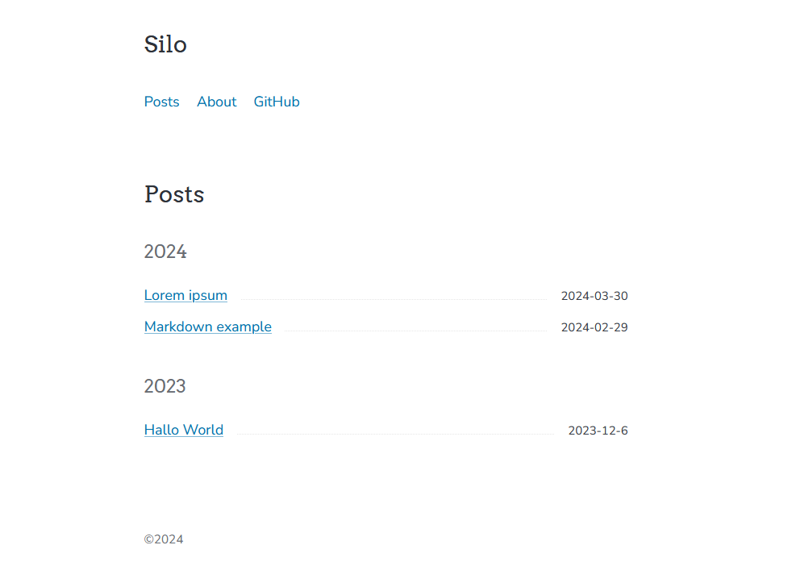

# Silo

Silo is a minimal [Zola](https://www.getzola.org/) theme that  made for my personal site.

### Screenshots



### Quick Start

```bash
# clone the repo
git clone git@github.com:joewe/silo.git
# change directory into the cloned folder
cd silo
# serve the site locally
zola serve
# open http://127.0.0.1:1111/ in the browser
```

For more detailed instructions, visit the [Documentation](https://www.getzola.org/documentation/themes/installing-and-using-themes/) page about installing and using themes.